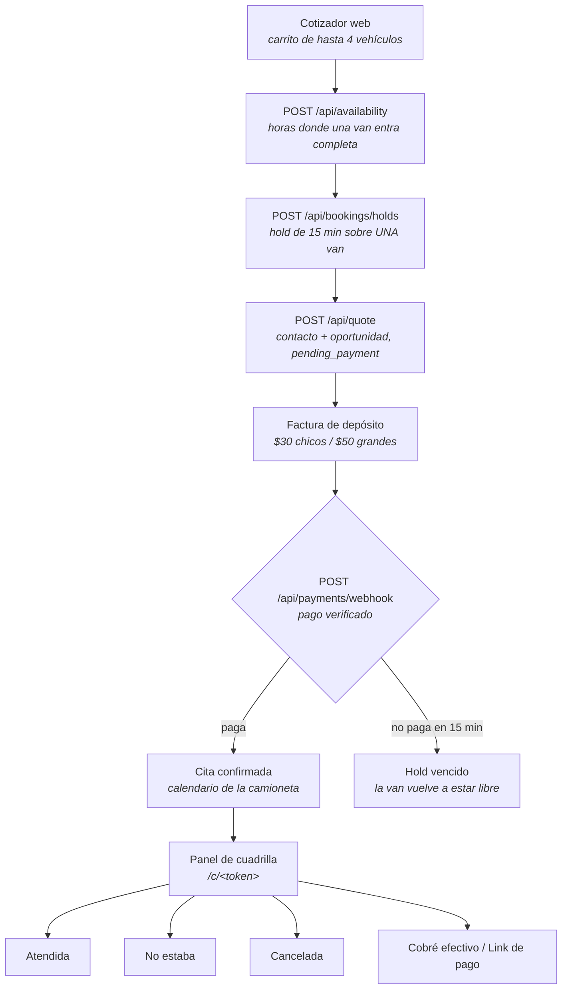
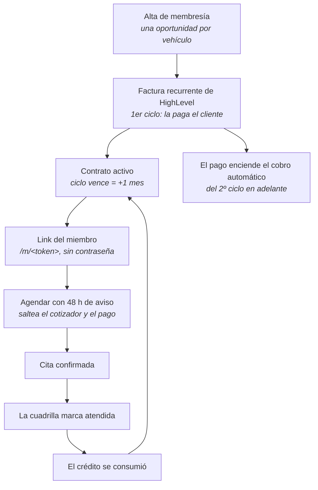

# Flujo del negocio — de la reserva al cobro

Reconstruido el **6 de agosto de 2026** leyendo el código en `api/` y el estado real de la
subcuenta de HighLevel. Es el mapa vigente: donde este documento contradice a `AGENDA.md`,
manda este (`AGENDA.md` describe el modelo pay-first con Postgres antes de que el panel de
la cuadrilla y el link del miembro salieran de la base de datos).

Docs relacionados: `PANORAMA.md` (qué se vende), `MEMBERSHIPS.md` (cobro recurrente),
`DISENO-SIN-BASE-DE-DATOS.md` (por qué el estado vive en el CRM).

---

## 1. La idea que explica todo lo demás

**Una visita es UNA camioneta en UNA dirección, atendiendo los vehículos uno tras otro.**

De ahí sale el resto: las duraciones se suman (tres autos son 3h30, no 1h30), el traslado
se cobra una sola vez, un horario se ofrece solo si una camioneta está libre de punta a
punta, y la flota limita **cuántas casas** se atienden a la vez, no cuántos autos.

## 2. El circuito principal

**La regla de oro:** una reserva **nunca** se confirma por llenar el formulario. Se confirma
cuando llega un pago verificado, y por nada más. Todo lo demás (hold vencido, pago fallido,
carrito abandonado) libera la camioneta.

## 3. El circuito de la membresía

**Los créditos no se guardan en ningún lado: se cuentan.** «Lavados usados» = citas de esa
membresía marcadas `showed` desde el inicio del ciclo. No hay contador que se desincronice,
y «¿por qué me queda uno?» se responde mirando el calendario.

Un ciclo pagado **reinicia** el saldo, no lo acumula: 2 + 2 nunca es 4.

## 4. Quién ve qué

| Persona | Entra por | Puede |
|---|---|---|
| Cliente nuevo | El cotizador del sitio | Cotizar, elegir hora, pagar el depósito |
| Miembro | `/m/<token>` por SMS/email | Ver su saldo y agendar. **Una visita abierta por contrato** |
| Cuadrilla | `/c/<token>`, uno por camioneta | Solo hoy, solo su van, cinco acciones, nada destructivo |
| Oficina | HighLevel | Todo lo demás |

Ninguno de los tres links tiene login. Son firmas HMAC: se invalidan todos rotando el
secreto, no hay usuarios que dar de baja.

## 5. Prender y apagar camionetas

**El interruptor es el calendario de la camioneta en HighLevel.** Desactivarlo la saca de
la venta; reactivarlo la devuelve. No hay variable de entorno que tocar, no hay que
desplegar, y la oficina lo hace sola.

Lo que cambia y lo que no:

| | Camioneta apagada |
|---|---|
| Disponibilidad en la web | Desaparece: sus horarios ya no se ofrecen |
| Reservas nuevas | No caen ahí, ni las de membresía |
| Citas ya agendadas | **Siguen en pie.** Apagar no cancela nada |
| Su panel de cuadrilla | Sigue funcionando, para cerrar lo que ya tenía |
| Créditos de membresía | Se siguen contando de todas las camionetas, prendidas o no |

Dos detalles operativos: el estado se cachea **un minuto**, así que apagar una camioneta
tarda hasta 60 segundos en verse en el sitio; y si HighLevel no responde, el sitio
**asume que están las cuatro trabajando** — un error de lectura no puede frenar la venta
en silencio.

Con las cuatro apagadas el cliente ve un calendario vacío, no un error. Es la misma
pantalla que vería una semana vendida por completo.

> ⚠️ **No se apaga borrando `GHL_CALENDAR_CAMIONETA_N` en Vercel.** Esa variable es la
> lista de camionetas que existen, no de las que trabajan: si falta una, el sitio
> responde 503 y deja de vender por completo.

## 6. Dónde vive cada cosa

| Qué | Dónde | Por qué ahí |
|---|---|---|
| La reserva | Una **cita** en el calendario de la camioneta | HighLevel valida y serializa los solapes |
| El cliente | El **contacto** | Ya estaba |
| La venta | La **oportunidad** | Un pipeline por tipo (servicios, membresías) |
| El pago | La **factura** | Consultar estado es idempotente por naturaleza |
| Los precios | `catalog-prices.json` + `pricing.js` | **El navegador manda ids, nunca importes** |
| El saldo de créditos | En ningún lado — se deriva | Un contador se corrompe; el calendario no miente |

## 7. Los puntos frágiles, dichos en voz alta

1. **La atomicidad es empírica, no contractual.** Que HighLevel rechace un solape está
   probado (3 de 3 corridas), pero no documentado como garantía. Las sondas
   `scripts/probe-ghl-slot-*.mjs` detectan en 10 segundos si algún día cambia.
2. **Plan Hobby de Vercel: 12 funciones exactas.** Cualquier ruta nueva rompe el deploy.
3. **Un solo cron por día**, así que los holds vencen de forma perezosa (al calcular
   disponibilidad) y el cron es solo la red de seguridad.
4. **Los links firmados son capacidades.** El de la cuadrilla puede marcar plata cobrada.
   No hay revocación individual: se rota el secreto y se reemiten los cuatro.
